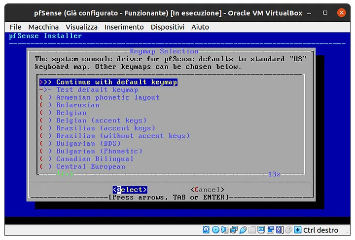
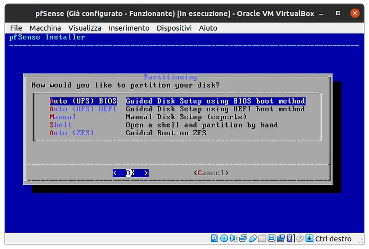
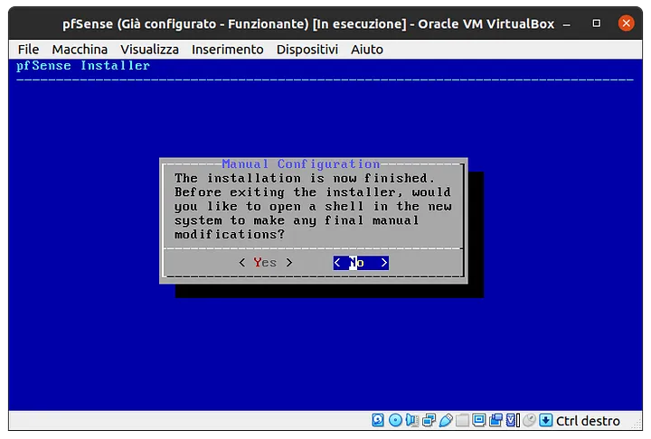
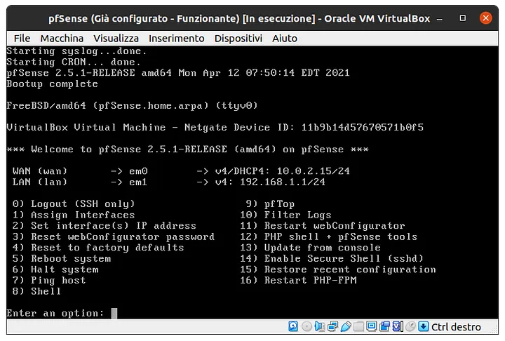
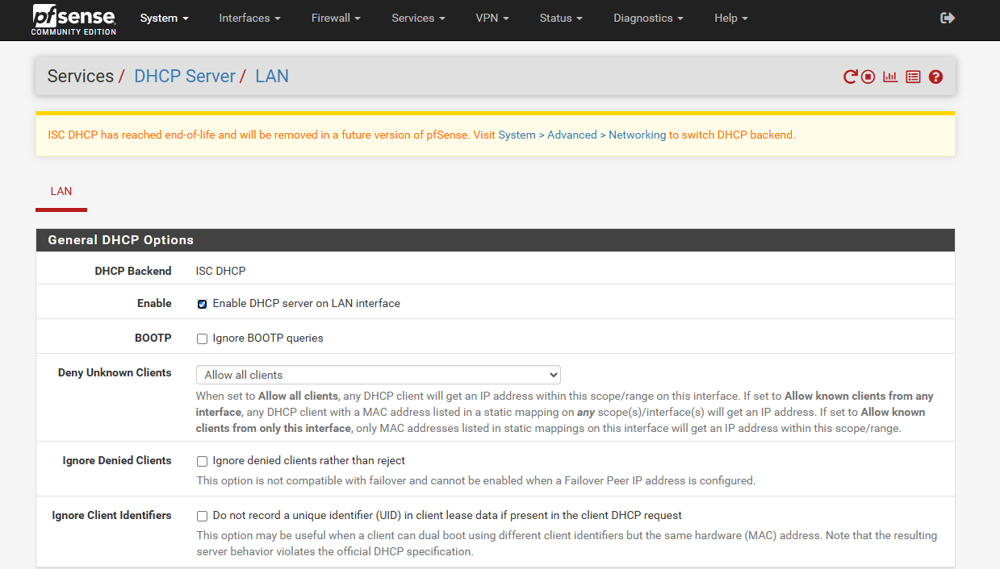
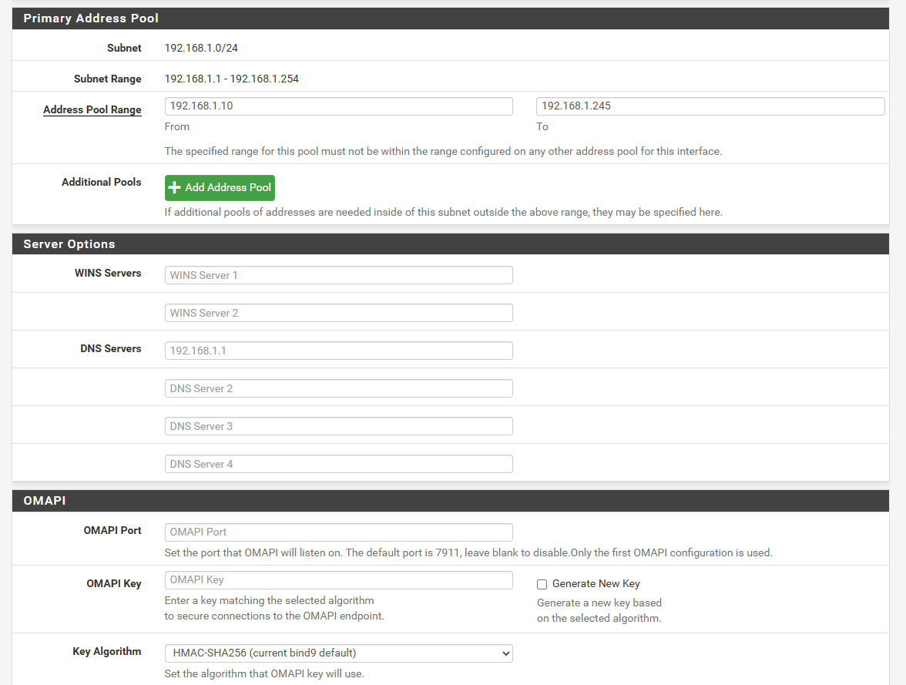
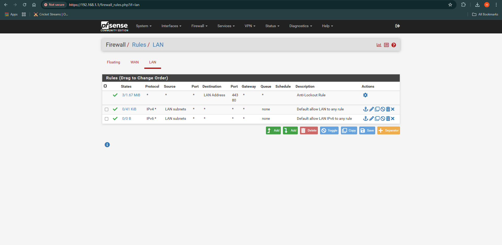
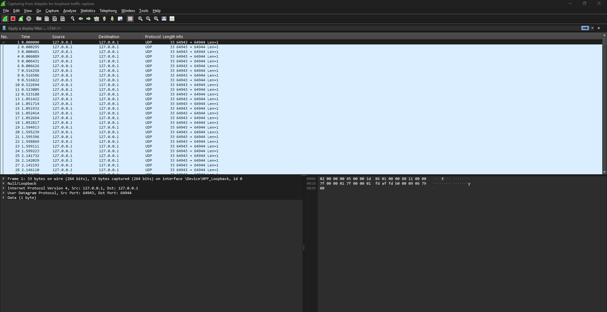

🚀 pfSense Firewall Lab Setup (VirtualBox)

## 📌 Overview
This project documents the **installation and configuration** of **pfSense** in a **VirtualBox environment**, covering **firewall security, networking, VPN setup, and troubleshooting**. This hands-on setup is ideal for learning **network security** and **system administration**.

---

📂 pfSense-Firewall-Lab  
 ├── 📁 docs/              # Step-by-step installation guide  
 ├── 📁 screenshots/       # Screenshots of the setup  
 ├── 📁 config/            # pfSense backup configuration files  
 ├── 🔹 README.md          # Project description & instructions  
 └── 🔹 pfSense-Setup-Guide.md  # Detailed setup guide  

---

🛠️ Features & Configurations
✔ Installed pfSense 2.7.2 in VirtualBox
✔ Configured WAN & LAN interfaces
✔ Set up firewall rules (allow/block traffic)
✔ Enabled DHCP Server & DNS Resolver
✔ Created a VPN tunnel (OpenVPN)
✔ Used Wireshark & Nmap for troubleshooting
---

🔧 Installation & Configuration Guide
1️⃣ Setting up VirtualBox for pfSense
Download pfSense ISO from pfSense Official Site
Create a New Virtual Machine in VirtualBox:
Type: BSD
Version: FreeBSD (64-bit)
Memory: 2GB RAM
Hard Disk: 10GB (Dynamically allocated)
Attach the pfSense ISO & Start Installation
Configure Virtual Network Adapters:
Adapter 1 (WAN) → NAT
Adapter 2 (LAN) → Host-Only Adapter
2️⃣ pfSense Installation Steps
Boot pfSense from the ISO and start the installation.
Choose Auto (UFS) as the partition scheme.
Confirm disk formatting and installation.
Once installed, remove the ISO and reboot.
Assign WAN to em0 and LAN to em1.
Access the pfSense Web GUI at: https://192.168.1.1
Login Credentials (default):
Username: admin
Password: pfsense
3️⃣ Configuring pfSense Network
✔ Change admin password & set timezone
✔ Configure WAN Interface (DHCP for internet access)
✔ Set LAN Interface with a static IP (e.g., 192.168.1.1/24)
✔ Enable DHCP Server to assign IPs to LAN clients
✔ Configure DNS Resolver for name resolution

4️⃣ Firewall & Security Settings
✔ Create firewall rules to allow/block specific traffic
✔ Restrict port access to prevent unauthorized usage
✔ Enable VPN for remote secure access (Optional: OpenVPN)

5️⃣ Troubleshooting & Monitoring
✔ Use Diagnostics > Ping in pfSense to test connectivity
✔ Run Wireshark to analyze network packets
✔ Use Nmap to scan open ports and verify firewall rules
---

## 📷 Screenshots

### ✅ pfSense Installation Screen

### ✅ Assigning WAN & LAN Interfaces

### ✅ pfSense Web Dashboard

### ✅ Firewall Rules Configuration

### ✅ Wireshark Packet Analysis

---

## 📝 Notes & Troubleshooting
- **Can't access 192.168.1.1?**
  - Ensure VirtualBox network settings are configured properly.
  - Restart the pfSense VM and check interface assignments.
  - Run ping 8.8.8.8 inside pfSense to test external internet access.

- **Firewall Rules Not Working?**
  - Check the rules under **Firewall > Rules > LAN/WAN**.
  - Ensure the correct **allow/block settings** are applied.

---

## 📌 Why This Project Matters
✅ **Real-world networking experience** with pfSense and firewall security.  
✅ **Demonstrates IT support skills** (troubleshooting, network monitoring).  
✅ **Showcases expertise in virtualization & security**.  
✅ **Great portfolio project for IT Support, Networking, or System Admin roles**.  

---

👨‍💻 About the Author
🚀 Muhammad Hammad
🔗 LinkedIn: mhammad24
🔗 GitHub: Muhammadhammad24

---

📢 **Want to improve this project?** Feel free to **fork & contribute!** 🚀
