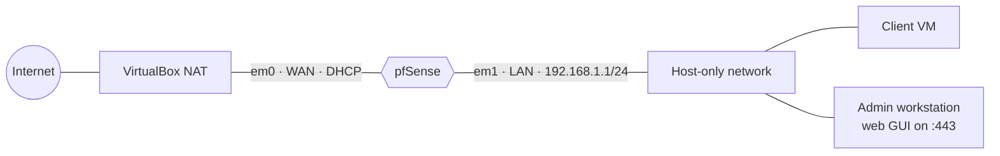

# pfSense Firewall Lab

A virtualised perimeter firewall built with pfSense CE on VirtualBox: a WAN/LAN
split, a DHCP-served LAN, stateful rules, and runbooks for each step so the
build can be reproduced from scratch.


[](https://github.com/Muhammadhammad24/pfSense-Firewall-Lab/actions/workflows/ci.yml)

## Topology


```mermaid
flowchart LR
    I((Internet)) --- N[VirtualBox NAT]
    N -- em0 · WAN · DHCP --- F{{pfSense}}
    F -- em1 · LAN · 192.168.1.1/24 --- H[Host-only network]
    H --- C1[Client VM]
    H --- C2[Admin workstation<br/>web GUI on :443]
```

| Interface | Adapter      | Addressing                     | Role                        |
| --------- | ------------ | ------------------------------ | --------------------------- |
| `em0`     | NAT          | DHCP from VirtualBox           | WAN, upstream to internet   |
| `em1`     | Host-only    | `192.168.1.1/24`, DHCP server  | LAN, protected client side  |

## What the lab covers

| Area | Implementation | Runbook |
| --- | --- | --- |
| Install | pfSense CE on FreeBSD 64-bit, 2 GB RAM, 10 GB disk, UFS | [Installation](docs/pfSense-Installation.md) |
| Interfaces | WAN on `em0`, LAN on `em1`, default admin credentials rotated at first login | [Installation](docs/pfSense-Installation.md) |
| DHCP and DNS | ISC DHCP on the LAN scope, DNS Resolver for clients | [Screenshots](#screenshots) |
| Firewall policy | Anti-lockout rule for the GUI, LAN egress rules for IPv4 and IPv6, WAN default-deny, plus a hardened egress policy as code | [Firewall rules](docs/Firewall-Rules.md) · [export](config/Firewall-Rules-Backup.xml) · [policy](policy/lab.toml) |
| Remote access | OpenVPN via the pfSense wizard, per-user client export | [VPN setup](docs/VPN-Setup.md) |
| Verification | Reachability with `ping`, exposed ports with `nmap` from outside the LAN | [Troubleshooting](docs/Troubleshooting.md) |

## Reproduce it

1. Create a VM: type **BSD**, version **FreeBSD (64-bit)**, 2 GB RAM, 10 GB disk.
2. Adapter 1 **NAT** (WAN), adapter 2 **Host-only** (LAN). Attach the pfSense ISO.
3. Install with **Auto (UFS)**, reboot, assign `em0` → WAN and `em1` → LAN.
4. Browse to `https://192.168.1.1` from a host-only client, sign in with the
   factory credentials, and **change the admin password immediately**.
5. Apply the rule set from [`config/Firewall-Rules-Backup.xml`](config/Firewall-Rules-Backup.xml)
   under _Diagnostics → Backup & Restore_, area **Firewall Rules**.

Step-by-step detail is in [`docs/`](docs).

## Policy as code

The factory LAN rules let every client reach anything on any port. The hardened
policy in [`policy/lab.toml`](policy/lab.toml) replaces them with explicit
egress, where every rule is reviewed in a diff:

| # | Action | Protocol | Destination | Port | Purpose |
| --- | --- | --- | --- | --- | --- |
| 1 | pass | TCP/UDP | this firewall | 53 | DNS through the pfSense resolver |
| 2 | pass | UDP | this firewall | 123 | NTP from pfSense |
| 3–4 | pass | TCP | any | 80, 443 | Web and package updates |
| 5 | pass | ICMP | any | | Ping and path MTU discovery |
| 6 | **block + log** | any | any | | Everything else |

[`tools/render_rules.py`](tools/render_rules.py) validates the policy
(interfaces, actions, protocols, port ranges, required descriptions) and
renders [`config/hardened-rules.xml`](config/hardened-rules.xml) in pfSense's
import format. Tracker IDs are derived from rule content, so output is
deterministic. CI fails if the committed XML drifts from the policy.

```bash
python tools/render_rules.py policy/lab.toml -o config/hardened-rules.xml
```

Import it under _Diagnostics → Backup & Restore_, restore area **Firewall
Rules**. The GUI anti-lockout rule is built into pfSense and stays in place.

## Rule-set audit

[`tools/audit_rules.py`](tools/audit_rules.py) parses an exported rule set and
flags policy mistakes before they reach the firewall:

| Severity | Check |
| --- | --- |
| high | WAN pass rules from any source to any destination |
| high | WAN rules that expose management ports (22, 80, 443, 3389, 8080, 8443), including inside port ranges |
| medium | Any-to-any pass rules on internal interfaces, meaning no egress filtering |
| low | Rules without a description, and disabled rules left in place |
| info | IPv6 pass rules, to confirm IPv6 is intended |

```console
$ python tools/audit_rules.py config/Firewall-Rules-Backup.xml
2 rules, 3 findings
  MEDIUM #1 [lan] Default allow LAN to any rule: lan may reach any destination on any port; consider egress filtering
  MEDIUM #2 [lan] Default allow LAN IPv6 to any rule: lan may reach any destination on any port; consider egress filtering
  INFO   #2 [lan] Default allow LAN IPv6 to any rule: IPv6 traffic is permitted; confirm IPv6 is in use
```

The medium findings on the factory rules are what the hardened policy fixes:

```console
$ python tools/audit_rules.py config/hardened-rules.xml --fail-on low
6 rules, 0 findings
```

On every push, CI runs the unit tests, audits the lab export for
high-severity issues, and audits the hardened set at the strictest level.
`--fail-on` sets the threshold and `--format json` gives machine-readable
output.

## Screenshots

| Installer | Interface assignment |
| --- | --- |
|  |  |

| DHCP server on LAN | LAN rule set |
| --- | --- |
|  |  |

<details>
<summary>Full installation sequence</summary>


</details>

## Security notes

- Only the firewall-rule section is exported. Full `config.xml` backups contain
  the admin password hash and the web GUI's TLS private key, so they are kept
  out of version control.
- The anti-lockout rule keeps the GUI reachable from the LAN. In production, restrict it to a
  management VLAN or disable it once an explicit admin rule exists.

## Roadmap

- [x] Automated audit of the exported rule set in CI
- [x] Explicit egress policy as code, rendered and audited in CI
- [ ] Import the hardened rules into the lab VM and verify them with `nmap` from a LAN client
- [ ] Segment the LAN with VLANs (users, servers, management) and inter-VLAN rules
- [ ] Suricata IDS on WAN with the ET Open ruleset, alerts to syslog
- [ ] pfBlockerNG IP and DNS blocklists
- [ ] Remote syslog and a Grafana dashboard for rule hits

## Repository layout

```
config/        lab rule export (sanitised) and the rendered hardened rule set
policy/        firewall policy as code (TOML)
docs/          runbooks: install, rules, VPN, troubleshooting
tools/         render_rules.py (policy → pfSense XML), audit_rules.py (policy checks)
tests/         renderer and audit tests, run in CI
screenshots/   evidence for each stage of the build
```

## License

[MIT](LICENSE)
